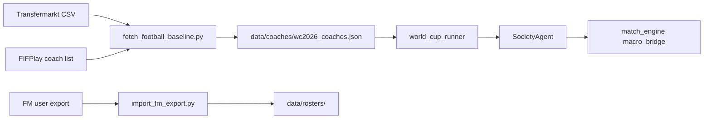

# 真实教练与球员数据（开放数据源，非 FM 盗版库）

## 说明：我没有 FM 内置数据库

AI / 本仓库**均不包含** Football Manager 官方 CA/PA/隐藏属性库，也无法合法批量下载 `.fmf` 存档。仿真用的是**开放数据 + 启发式能力映射**：

| 数据 | 来源 | 生成文件 |
|------|------|----------|
| 主教练 | [FIFPlay WC2026 名单](https://www.fifplay.com/world-cup-2026-head-coaches/) | `data/coaches/wc2026_coaches.json` |
| 球员名单 | [Transfermarkt 开放数据集](https://github.com/dcaribou/transfermarkt-datasets) | `data/rosters/{Team}.json` |
| 能力值 | 动力学 `condition` + `channel_affinities` → 混合 `abilities`（与教练同结构） | 同上 |

若你有 FM 正版，可自行导出 CSV/HTML，用 `import_fm_export.py` **覆盖**某国名单（见下文）。

## 一键拉取基线数据（教练 + TM 元数据）

```powershell
cd D:\path\to\GFS-sparse
python scripts\fetch_football_baseline.py
```

生成：

- `data/external/transfermarkt/*.csv.gz` — FIFA 排名、市值、球员库等
- `data/coaches/wc2026_coaches.json` — 48 队主教练 + 推导的心理/战术先验
- `data/rosters/*.json` — 48 队各 23 人（Transfermarkt 国籍筛选 + 市值排序）

仿真启动时 `build_world_and_tournament()` 自动加载教练与 `data/persistence/squad_carryover.json`（跨场记忆）；微观比赛 `build_team_squad()` **优先读 roster**（含伤病/停赛后的 `_roster_carryover_snapshot`），无文件时才合成 11 人。

能力核对：`python scripts/verify_rosters.py` → `data/persistence/roster_verification.json`（TM 市值 vs `abilities.tech` 先验）。

战术：LLM 返回 `tactical_preset` + `tactical_hints` 后，`apply_coach_tactics_from_llm` 同步完整 21 维 `tactical_vector`；传球图由 `channel_affinities` 直接调制 `passing_engine` 效用。

## 单场顺序（微观优先）

`MATCH_MICRO=1` 时默认 **physics-first**（可用 `MATCH_MICRO_SCORE=0` 退回旧的「宏观定分 + 微观重演」）：

1. 空间场 + 传球物理（轨迹/弧线/拦截）+ 射门物理（扑救/进球）+ 情绪 ODE + 认知 LLM  
2. 日志 `[MICRO]` / `[COGNITIVE]` / `[AFFECTIVE]`  
3. **`[SCORE]`** 来自射门物理统计 `goals_micro_*`，不是预先写死的宏观 Poisson  

宏观 `expected_match_xg` 仅作犯规/射门日程的 **密度先验**，不预定进球数。

### 进球标定（v3，physics-first）

- 传球/射门：`action_pass_base`↓、`action_shot_base`↑、禁区内日程射门 reposition  
- 门将略弱化、`xg_geom_base`↑  
- 物理进球为 0 且该队 **μxG > 1.2** 时：`Poisson(μxG×0.88)` 补 0–2 球（见 `[XG-SUPPLEMENT]` 日志）  
- `softmax` / 传球效用做 **NaN 清理**，减少 `Probabilities contain NaN` 回退

## 逐脚球路日志（围观）

```powershell
$env:MATCH_BALL_LOG="1"          # 每场写 outputs/ball_log/<主队>_vs_<客队>_<阶段>.txt|.jsonl
$env:MATCH_BALL_LOG_MAX="800"    # 单场最多记录条数（传球+射门）
# $env:MATCH_BALL_LOG_DIR="D:\logs\ball"  # 可选自定义目录
```

示例行：

```text
23:14 PASS through Brazil Brazil CM [CM] → Brazil Brazil LW [LW] | (0.412,0.505)→(0.581,0.318) d=0.198 ...
67:02 SHOT curved Brazil Brazil ST [ST] vs Argentina Argentina GK [GK] | (0.812,0.502) d=0.089 xG=0.31 | **GOAL**
```

一键重启全量（会先尝试结束旧的 `run_world_cup_2026_full.py`）：

```powershell
cd D:\path\to\GFS-sparse
.\scripts\restart_full_run.ps1
```

## 宏观 xG 标定（v2）

`macro_goal_dynamics` 中 λ 为**每分钟进球强度**（≈0.01–0.03），90 分钟积分后 xG 限制在 **0.28–3.6**。与微观 xG 融合后再 Poisson 采样，避免出现 80+ xG。

## 单场双系统（系统1 + 系统2）

详见 [COGNITIVE_DUAL_SYSTEM.md](COGNITIVE_DUAL_SYSTEM.md)。`MATCH_COGNITIVE=1` 时赛中事件触发 LLM/规则计划写回情绪与战术状态。

仅生成球员名单：

```powershell
python scripts\build_rosters_from_transfermarkt.py
```

## FM 球员导出 → 国家队名单（可选）

1. 在 FM 中打开该国球员搜索，显示 CA/PA、位置、关键属性列。
2. 导出为 **CSV**（分号分隔）或 **HTML**。
3. 运行：

```powershell
python scripts\import_fm_export.py "D:\path\to\player_export.csv" --nation Brazil
```

按**姓名匹配**覆盖 TM roster 中的 `abilities`（`source: transfermarkt+fm`）。无 TM 文件时加 `--fm-only` 可从 FM 单独建队。

```powershell
python scripts\import_fm_export.py export.csv --nation Brazil --rebuild-dynamics
```

## 微观逐人统计 → 跨场记忆

`MATCH_MICRO=1` 时，`PlayerMatchStatsTracker` 记录传球/射门/xG/黄红牌/出场时间；赛后写入 `squad_carryover`（`form_ema`、`condition_delta`、停赛、伤病概率）。

## 替补 / 换人

Roster 23 人：11 `starter`（`on_pitch`）+ 替补在替补席坐标。微观比赛在约 **58' / 70' / 82'** 按体能自动换人（每队最多 5 次），并记入 `MicroMatchSummary.substitutions`。

## 教练 JSON 字段

见 `data/schemas/coach.schema.json`。核心字段：

- `name` / `nationality` / `in_charge_since`
- `preferred_preset` — 对应 `tactical_catalog.TACTICAL_PRESETS`
- `mental` — `experience`, `tactical_knowledge`, `pressure_handling` 等 0–1，影响 `coach_authority` 与微观 `CoachAffectiveState`

## 更新教练名单

世界杯前人事变动时：

1. 编辑 `scripts/fetch_football_baseline.py` 中的 `FIFPLAY_WC2026_COACHES`，或
2. 直接改 `data/coaches/wc2026_coaches.json` 后重跑仿真。

## 数据流（简图）


