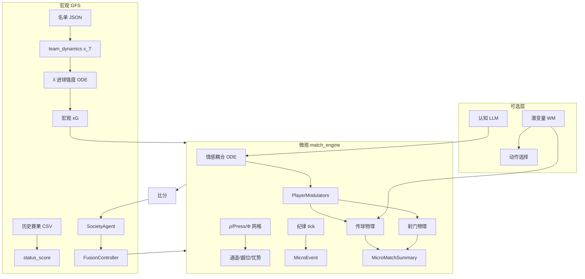

# GFS World Cup 2026 Simulator — 完整项目规格书

> **版本**：与仓库当前实现同步（微观引擎 + 情感耦合 + 认知 LLM + 潜变量世界模型 + StatsBomb 校准）  
> **坐标系**：球场归一化 \([0,1]^2\)，\(x\) 为纵向（主队攻向 \(x\to 1\)），\(y\) 为横向。  
> **设计原则**：几乎**无硬阈值**；门控一律用 `sigmoid` / `softmax` / `tanh` / `exp` 等连续函数。

---

## 目录

1. [系统总览](#1-系统总览)
2. [仓库结构与数据流](#2-仓库结构与数据流)
3. [宏观层：球队状态与进球动力学](#3-宏观层球队状态与进球动力学)
4. [SocietyAgent：心理、记忆、信念、战术](#4-societyagent心理记忆信念战术)
5. [融合层 FusionController](#5-融合层-fusioncontroller)
6. [锦标赛编排](#6-锦标赛编排)
7. [微观比赛引擎总览](#7-微观比赛引擎总览)
8. [Phase 1b：情感–空间耦合](#8-phase-1b情感空间耦合)
9. [Phase 2a：空间场与运动学](#9-phase-2a空间场与运动学)
10. [Phase 2b：空间智能与传球](#10-phase-2b空间智能与传球)
11. [Phase 3：球物理、射门、动作选择](#11-phase-3球物理射门动作选择)
12. [纪律事件：tick 犯规与日历](#12-纪律事件tick-犯规与日历)
13. [宏观–微观比分融合](#13-宏观微观比分融合)
14. [认知双系统（LLM System 2）](#14-认知双系统llm-system-2)
15. [潜变量世界模型](#15-潜变量世界模型)
16. [数据工程：名单、教练、FM](#16-数据工程名单教练fm)
17. [StatsBomb 开放数据校准](#17-statsbomb-开放数据校准)
18. [持久化与输出](#18-持久化与输出)
19. [环境变量大全](#19-环境变量大全)
20. [脚本索引](#20-脚本索引)
21. [相关专题文档](#21-相关专题文档)

---

## 1. 系统总览

本项目模拟 **2026 世界杯** 全赛：48 队、12 组、淘汰赛、点球、伤停补时式微观物理、可选 LLM 教练/裁判认知层。



**三层时间尺度**：

| 尺度 | 时间步 | 模块 | 输出 |
|------|--------|------|------|
| 宏观 | 赛前/赛后 | `macro_goal_dynamics`, `FusionController`, `SocietyAgent` | 有效实力、宏观 xG、心理漂移 |
| 中观 | 15 min 窗 | `MesoAggregator` | `MicroAppraisalPacket` → GFS 叙事 |
| 微观 | 6 s/tick（默认） | `match_micro_runner` | 传球/射门/犯规统计、物理进球、`micro_xg` |

---

## 2. 仓库结构与数据流

### 2.1 顶层目录

| 路径 | 说明 |
|------|------|
| `run_world_cup_2026_full.py` | 全赛入口，写 `outputs/full_run_latest.log` |
| `run_match_micro.py` | 单场微观测试 |
| `src/simulation/` | 锦标赛、`SocietyAgent`、LLM、融合 |
| `src/match_engine/` | 微观物理 + 情感 + 认知 + WM |
| `src/memory_engine/` | 宏观 λ、Poisson、status_score |
| `src/data_engine/` | 名单、教练、FM、实体动力学 |
| `data/` | 原始数据、名单、校准、checkpoint |
| `scripts/` | 构建名单、训练 WM、基准测试 |
| `docs/` | 设计文档（本文档为总集） |

### 2.2 单场完整数据流

```
world_cup_runner.build_world_and_tournament()
  → TournamentManager.play_match(home, away)
      1. prepare_match_agents()     # squad_carryover 伤病/停赛/体能
      2. LLM coach_decide_tactics() # 阵型 + 四旋钮 + 预设
      3. apply_beliefs_to_tactics() # 信念 → 战术微调
      4. simulate_internal_game()   # 教练–球员博弈
      5. FusionController.fuse()    # 五专家 → effective_status
      6. expected_match_xg()          # λ ODE → 宏观 xG 先验
      7. run_match_micro_simulation() # 可选 MATCH_MICRO=1
      8. resolve_unified_score()      # 物理进球 或 宏观+微观融合
      9. recursive_update()         # 赛后心理/记忆
     10. save squad_carryover + tournament_checkpoint
```

---

## 3. 宏观层：球队状态与进球动力学

**文件**：`src/memory_engine/macro_goal_dynamics.py`

### 3.1 球队状态向量

\[
\mathbf{x}_T = [\text{attack},\ \text{defense},\ \text{press},\ \text{morale\_field},\ \text{institutional\_pressure}]^\top \in [-1,1]^5
\]

来源优先级：
1. 名单 `team_dynamics`（`entity_dynamics.py` 计算）
2. 回退：`team_vector_from_status(status_score)`

**仅 status 时的回退**：
\[
s = \tanh\frac{\text{status} - 35}{18},\quad
\mathbf{x} = [s,\ 0.92s,\ 0.55s,\ 0.65s,\ \tanh\frac{50-\text{status}}{25}]^\top
\]

**融合后修正**（`team_vector_from_agent`）：
\[
\delta = \tanh\frac{\text{eff\_status} - \text{anchor}}{12},\quad
\mathbf{x} \leftarrow \mathbf{x} + [0.42,0.18,0.22,0.35,0]\cdot\delta + [0,0,0.12,0.08,0]\cdot\tanh(\text{volatility})
\]

### 3.2 进球强度 ODE

\(\lambda(t)\) 为单位时间期望进球率（goals/minute）。

**驱动项**：
\[
\begin{aligned}
\text{att\_def} &= x_{\text{self}}^{(0)} - x_{\text{opp}}^{(1)} \\
\text{morale\_gap} &= x_{\text{self}}^{(3)} - x_{\text{opp}}^{(3)} \\
\text{tempo} &= \tfrac{1}{2}(x_{\text{self}}^{(2)} + x_{\text{opp}}^{(2)})
\end{aligned}
\]

\[
\text{drive} = 0.011\cdot\text{softplus}(1.35\cdot\text{att\_def})
            + 0.0055\cdot\text{softplus}(0.9\cdot\text{morale\_gap})
            + 0.0035\cdot\text{softplus}(0.7\cdot\text{tempo})
            + 0.0025
\]

**衰减与赛制项**：
\[
\text{decay} = 2.85\,\lambda_{\text{self}} + 0.04\,\lambda_{\text{opp}}\cdot\sigma(\text{att\_def})
\]
\[
\dot\lambda_{\text{self}} = \text{drive} - \text{decay} - \text{ko\_drag} - \text{stage\_drag}
\]

- `ko_drag = 0.0035`（淘汰赛）
- `stage_drag = 0.0025 · tanh(stage_pressure) · σ(institutional_pressure)`

**约束**：\(\lambda \in [0.004,\ 0.065]\) goals/min

### 3.3 宏观 xG 积分

Euler 积分 \(n=90\) 步，\(dt = 90/n\) 分钟，每步加高斯噪声 \(\mathcal{N}(0, 0.0012^2)\)：

\[
xG = \int_0^{90} \lambda(t)\,dt,\quad xG \in [0.28,\ 3.6]
\]

**进球采样**：
\[
G \sim \text{Poisson}(xG),\quad G \leftarrow \text{soft\_goal\_cap}(G, xG)
\]

软封顶（`poisson_simulator._soft_goal_cap`）：
\[
\text{cap} = \lceil \lambda + 3.2\sqrt{\lambda+0.15} + 1 \rceil
\]

### 3.4 历史 status_score

**文件**：`src/memory_engine/status_score.py`

\[
w_{\text{points}} = \text{points} \cdot w_{\text{tournament}} \cdot e^{-\lambda_{\text{decay}} \cdot \text{years\_ago}}
\]
\[
C_1 = \frac{\sum w_{\text{points}}}{\sum w_{\max}} \cdot 100
\]
\[
\text{final\_status} = \text{normalize}\big(0.30\cdot\text{historical\_base} + 0.70\cdot\text{modern\_power}\big)
\]

时间衰减半衰期：50 / 25 / 15 年（按赛事权重）。

---

## 4. SocietyAgent：心理、记忆、信念、战术

**文件**：`src/simulation/agent.py`

### 4.1 潜变量 `z_state`

键：`morale`, `stability`, `unity`, `confidence`, `risk_tolerance`, `pressing_intensity`, `referee_trust`, `media_sensitivity`

投影到可观测控制量用 \(\sigma\) / \(\tanh\)。

### 4.2 信念系统（Beliefs）

每条信念 \(b\) 含：`prototype` 向量、`support`、`contradiction`、`confidence`、`policy_effect`（对战术旋钮的映射）。

**赛后更新**（`update_beliefs_from_match_event`）：

\[
\text{alignment} = \cos(\mathbf{m}_{\text{vec}}, \mathbf{proto})
\]
\[
\Delta\text{support} = w_{\text{mem}} \cdot \sigma(k_{\text{align}} \cdot \text{alignment})
\]
\[
\Delta\text{contradiction} = w_{\text{mem}} \cdot \sigma(-k_{\text{align}} \cdot \text{alignment})
\]
\[
\text{support} \leftarrow \rho_b \cdot \text{support} + \Delta\text{support},\quad \rho_b = 0.97
\]
\[
\text{confidence} = \sigma\big(\alpha_{\text{conf}} \cdot (\text{support} - \text{contradiction})\big)
\]
\[
\mathbf{proto} \leftarrow \rho_b \cdot \mathbf{proto} + (1-\rho_b)\cdot \mathbf{m}_{\text{vec}}
\]

**赛前战术施加**（`apply_beliefs_to_tactics`）：

\[
\text{activation}_b = \sigma(s_b \cdot (\text{conf}_b - c_0)) \cdot \text{conf}_b
\]
\[
\Delta\text{control}_k = \delta_{\max} \cdot \tanh\!\left(\frac{\sum_b \text{activation}_b \cdot \text{policy\_effect}_{b,k}}{\delta_{\max}}\right)
\]

### 4.3 记忆显著性

\[
z_{\text{mem}} = 1.8|\text{impact}| + 1.2\cdot\max(\text{emotion}) + \text{novelty} + 1.4\cdot w_{\text{stage}} + 0.25\cdot\text{importance} - 2.0
\]
\[
w_{\text{memory}} = \sigma(z_{\text{mem}})
\]

### 4.4 赛后心理递归（`recursive_update`）

\[
\gamma_{\text{Cinderella}} = \tanh\big(\text{momentum} \cdot (1-\text{media\_exposure})^2\big)
\]
\[
\text{surprise} = \max\!\left(0, \frac{\text{opp\_status} - \text{status}}{100}\right)
\]
\[
z_{\text{morale}} \leftarrow \rho_s z + 0.55\cdot\text{impact} + 0.32\cdot\text{pride} - 0.38\cdot\text{shame} - 0.26\cdot\text{fear} + 0.16\cdot\text{belief\_context} + \varepsilon
\]

### 4.5 战术向量（21 维）

**文件**：`src/match_engine/tactical_catalog.py`, `tactical_profile.py`

由 `style_desc` + 教练 `preset_affinities` + 四旋钮 `tactical_controls` 混合：

\[
\mathbf{v}_{\text{tac}} = \text{blend}(\text{preset},\ \text{controls},\ w)
\]
\[
v_i' = \sigma(2 v_i - 1),\quad \forall i \in \text{TACTICAL\_KEYS}
\]

四旋钮：`pressing_intensity`, `risk_budget`, `line_height`, `rotation_aggressiveness`

---

## 5. 融合层 FusionController

**文件**：`src/simulation/fusion_controller.py`

五专家：`phys`, `affect`, `social`, `tactic`, `governance`

**上下文门控 logits**：
\[
\ell_{\text{phys}} = 0.05 + 0.38 p_{\text{stage}}
\]
\[
\ell_{\text{affect}} = 0.10 + 0.42 p + 0.25|\tanh(\text{chaos})|
\]
（其余类似）

**权重**：\(\mathbf{w} = \text{softmax}(\boldsymbol\ell)\)

**融合**：
\[
\Delta\text{status} = \sum_k w_k \cdot \text{expert}_k.\text{status}
\]
\[
\text{eff\_status} = \text{agent.get\_effective\_status}(\text{matchup\_bonus} + 0.55\cdot\Delta\text{status})
\]

---

## 6. 锦标赛编排

**文件**：`src/simulation/tournament_2026.py`, `knockout_bracket.py`, `tournament_checkpoint.py`, `venue_policy.py`

### 6.1 赛制

- 12 组 × 4 队，每组前 2 + 8 个最佳第三 → 32 强
- 淘汰赛：R32 → R16 → QF → SF → Final
- 平局：加时（可跑完整微观 `MATCH_MICRO`）→ 点球

### 6.2 主场规则（`venue_policy.py`）

2026 联合主办：`neutral_venue` 对非东道主对阵；东道主主场有 crowd ψ 加成（非直接改 possession prior）。

### 6.3 Checkpoint

`data/persistence/tournament_checkpoint.json`：已完成场次、积分榜、淘汰赛 bracket。

恢复：`run_world_cup_2026_full.py --resume` 或 `scripts/resume_full_run.ps1`

---

## 7. 微观比赛引擎总览

**主入口**：`src/match_engine/match_micro_runner.py` → `run_match_micro_simulation()`

**默认配置**：`MicroMatchConfig`（`micro_config.py` 继承 `AffectiveConfig`）

| 参数 | 默认 | 含义 |
|------|------|------|
| `dt_default` | 6.0 s | 每 tick 时长 |
| `match_seconds` | 5400 | 90 分钟 |
| `n_ticks` | 900 | \(\lfloor 5400/6 \rfloor\) |

### 7.1 Tick 循环（摘要）

见 [Phase 1b–3](#8-phase-1b情感空间耦合) 各节；顺序：

1. 日历事件切片 `event_schedule`
2. `tactical_eng.step_in_match_pressure`
3. `spatial.step` + `sie.step`
4. `affective.step` → `PlayerModulators`
5. `emit_tick_discipline` / tackle / cross
6. `kinematic.step`
7. `ActionEngine.step` → `PassingEngine` / `ShotEngine` / `AerialDuelEngine`
8. 换人、认知层、`meso.record_tick`

### 7.2 输出 `MicroMatchSummary`

关键字段：`passes_*`, `pass_completion_*`, `shots_*`, `micro_xg_*`, `goals_micro_*`, `fouls_*`, `yellow_*`, `red_*`, `tackles_*`, `crosses_attempted`, `headers_attempted`, `possession_home`, `cognitive_*`, `ball_log_path`

---

## 8. Phase 1b：情感–空间耦合

**文件**：`src/match_engine/affective_coupling.py`, `config.py`, `micro_events.py`

### 8.1 数学原语（`math_utils.py`）

\[
\sigma(x) = \frac{1}{1+e^{-\text{clip}(x,-20,20)}},\quad
\text{softmax}(z_i) = \frac{e^{z_i/\tau}}{\sum_k e^{z_k/\tau}}
\]

### 8.2 观众 ψ

\[
\dot\psi = \psi_{\text{goal}}\cdot g_{\text{pulse}} + 0.15 H - \psi_{\text{decay}}\cdot\psi
\]
\[
H = \text{home\_adv} \cdot \tanh(0.35\cdot(\text{score}_H - \text{score}_A)
\]

### 8.3 球员情绪 `z_emo`（4 维 softmax → pride, anger, fear, determination）

\[
\dot{\mathbf{z}}_{\text{emo}} = -d_{\text{decay}}\mathbf{z} + \text{peer\_coupling} + \mathbf{c}_{\text{crowd}}\cdot\text{fan\_affinity}
\]

**士气 logit**：
\[
\dot m = -0.05 m + 0.018\tanh(\text{sign}\cdot\psi)\cdot\text{fan} + 0.04(\text{pride}-\text{fear}) + 0.02\cdot\text{det}
\]

### 8.4 PlayerModulators（影响微观决策）

| 输出 | 公式 |
|------|------|
| `tau_dec` | \(\tau_0(1 + 0.35 q + 0.55 f + 0.40 a)\) |
| `vision_scale` | \(\text{clip}_{[0.35,1.15]}(V_0(1-0.25f-0.18a))\) |
| `move_alpha` | \(\text{clip}(\alpha_0\cdot\sigma(\text{stamina})\cdot\sigma(\text{spatial})\cdot(1+0.22d-0.28f))\) |
| `shot_utility_bias` | \(0.35a - 0.30f + 0.08\cdot\text{pride}\) |
| `foul_impulse` | \(0.25a + 0.12\cdot 0.5 f + 0.1\cdot\text{card\_load}\cdot a\) |

### 8.5 裁判严格度

\[
s = s_{\text{base}} + \kappa_{r\psi}\tanh(\psi - \psi_0) - \kappa_{rc}\cdot\text{calm}
\]
\[
\text{strictness} = \sigma(4s - 2)
\]

### 8.6 犯规强度标量 λ_foul

\[
\lambda_{\text{foul}} = \lambda_{\text{base}} \exp\big(\delta_s(\text{strict}-0.5) + \delta_p\cdot 0.5(\text{press}_H+\text{press}_A)\big)
\]

默认 \(\lambda_{\text{base}}=0.06\), \(\delta_s=1.40\), \(\delta_p=0.35\)

### 8.7 MicroEvent 脉冲

`micro_events.apply_micro_event` 对 `z_emo`、教练 `z_stress/z_trust/z_rage`、裁判 `card_load` 等施加连续冲量；返回 crowd pulse \(g_\psi\)。

---

## 9. Phase 2a：空间场与运动学

### 9.1 占有密度 ρ（`spatial_field.py`）

网格默认 \(32\times 22\)。

**衰减 + 球员核注入 + 球源**：
\[
\rho \leftarrow \rho(1 - \rho_{\text{decay}}\cdot dt) + \text{kernels}
\]

**扩散（5 点 Laplacian）**：
\[
\rho' = \rho + \alpha(\rho_{i+1,j}+\rho_{i-1,j}+\rho_{i,j+1}+\rho_{i,j-1} - 4\rho_{i,j}),\ \alpha = D_0\cdot dt
\]

**互斥压制**：
\[
\rho_H \leftarrow \max(0,\ \rho_H - dt\cdot\lambda_{\text{press}}\cdot\rho_H\cdot\rho_A)
\]

**压迫场**：
\[
\text{press} = p_m(\text{tac}_H)\cdot\text{pressing}_H\cdot\rho_A + p_m(\text{tac}_A)\cdot\text{pressing}_A\cdot\rho_H
\]
\[
p_m = 0.50 + 0.40\cdot\text{press} + 0.22\cdot\text{counterpress} + 0.12\cdot\text{man\_press}
\]

### 9.2 运动学（`kinematic_position.py`）

\[
\text{phase} \leftarrow \text{phase} + \kappa_{\text{phase}}(\sigma(\text{poss}+\text{line}-\text{press}_{\text{against}}) - \text{phase})
\]
\[
\mathbf{v} \leftarrow 0.65\mathbf{v} + 0.35\mathbf{v}_{\text{des}},\quad \|\mathbf{v}\| \le \alpha_{\text{move}}\cdot v_{\max}
\]
\[
\mathbf{p} \leftarrow \text{clip}(\mathbf{p} + \mathbf{v}\cdot dt/10)
\]

---

## 10. Phase 2b：空间智能与传球

### 10.1 空间智能 SIE（`spatial_intelligence.py`）

**高斯核**：
\[
K(\mathbf{r},\mathbf{p}) = \exp\!\left(-\frac{\|\mathbf{r}-\mathbf{p}\|^2}{2\sigma_p^2}\right),\ \sigma_p = 0.06
\]

**Φ 优势网格**：
\[
z_\Phi = a_0 + a_1\frac{\rho_o}{\rho_o+\rho_p+\epsilon} - a_2\sum_{\text{opp}} K - a_3\sum_{\text{own}} K
\]
\[
\Phi = \sigma(z_\Phi)
\]

**越位风险**：
\[
z_{\text{off}} = \gamma_{\text{off}}(x_{\text{tgt}} - x_{\text{line}} - \delta_{\text{off}}) + 4\cdot\text{asst\_mod}
\]
\[
\text{offside\_risk} = \sigma(z_{\text{off}})
\]

**通道质量**（弦上 \(M=8\) 采样）：
\[
Q = \exp\!\left(-\frac{1}{M}\sum_{s\in[0,1]}\big(\mu_1\cdot\text{press}(s) + \mu_2\sum_{\text{opp}}K(s,o)\big)\right)
\]

### 10.2 传球效用（`passing_engine.py`）

\[
u = b_\phi\Phi + b_{\text{lane}} Q + b_{\text{off}}\ln(1-\text{off}+\epsilon) + 0.6\cdot\text{adv} - b_{\text{dist}} d + u_{\text{kind}} + w_{\text{mix}}\ln\frac{p_{\text{kind}}}{p_{\text{ref}}}
\]
\[
u \leftarrow u \cdot \text{pass\_skill} \cdot \text{vision\_scale}
\]

**选择**：
\[
P(\text{cand}_i) = \text{softmax}(u_i,\ \tau = \tau_{\text{pass\_base}}\cdot\tau_{\text{dec}})
\]

### 10.3 传球成功率 logit

**锚点**（StatsBomb WC2022 总成功率 82.24%）：
\[
z_0 = \text{logit}(0.8224)
\]

**物理项**：
\[
z = z_0 + 0.95(\text{pass\_skill}-0.55) + b_{\text{lane}} Q - 0.24\cdot\text{press} - 0.14 d - 0.06(\tau_{\text{dec}}-\tau_0) - \text{exec\_penalties} - 0.24\cdot\text{intercept\_risk}
\]

**执行误差**（次线性，`pass_exec_miss_gamma=0.55`）：
\[
\text{soft\_miss}(x) = \text{cap}\cdot\left(\frac{\min(x,1.15\cdot\text{cap})}{\text{cap}}\right)^\gamma
\]

**按种类缩放** `kind_scale`：short 0.42, through 0.68, long 1.0, wall 0.50

**地面球减免**：`ground_relief = 1 - 0.5·ground_weight`

**校准混合**（`pass_calibration.py`，`data/calibration/statsbomb_pass_rates.json`）：
\[
z_{\text{final}} = (1-w)\,z + w\cdot\text{logit}(p_{\text{target}}(\text{kind},d)),\quad w \approx 0.70\text{–}0.88
\]
\[
P(\text{complete}) = \sigma(z_{\text{final}}),\quad \text{completed} = U < P \land \neg\text{intercepted}
\]

**目标成功率**：short 85.3%, through 74%, long 62.2%（StatsBomb）

### 10.4 拦截（`pass_intercept.py`）

**追逐权重**：
\[
w_p = \text{clip}\big(\sigma(w_b + g_p\max(0,\text{press}-0.25) + g_l\max(0,0.5-Q) - 1.8d + 0.4\cdot\text{pace}),\ 0.08,\ 0.92\big)
\]

**拦截几何概率**：
\[
p_{\text{geom}} = \sigma(b_0 + 3.2\cdot\text{reach\_edge} - 4.5\max(0,d-r))
\]
\[
P_{\text{int}} = \text{clip}(p_{\text{geom}}\cdot\text{risk}\cdot s_{\text{calib}}\cdot 8,\ 0,\ 0.22)
\]

\(s_{\text{calib}} =\) `intercept_risk_scale`（JSON 中约 0.014）

### 10.5 球物理传球 ODE（`ball_physics.py`）

状态 \((\mathbf{p}, \mathbf{v}, \boldsymbol\omega)\)，步长 `phys_dt=0.012`。

\[
\mathbf{F}_{\text{drag}} = -c_d \|\mathbf{v}\|\mathbf{v},\quad
\mathbf{F}_{\text{Magnus}} = c_m (\boldsymbol\omega \times \mathbf{v})
\]
\[
\mathbf{a} = [F_x, F_y, -g + F_z]^\top,\quad \mathbf{v}\leftarrow\mathbf{v}+dt\mathbf{a},\ \mathbf{p}\leftarrow\mathbf{p}+dt\mathbf{v}
\]

**地面滚球**：低 \(z\) 时摩擦 + `pass_roll_stabilize` 使球沿目标方向收敛。

---

## 11. Phase 3：球物理、射门、动作选择

### 11.1 动作选择（`action_engine.py`）

效用向量：\([\text{pass}, \text{shot}, \text{cross}, \text{hold}]\)

\[
u_{\text{shot}} = u_{\text{base}} + u_{\max}^{\text{shot kinds}}\cdot\text{shot\_bias}(\text{tac}) + u_{\text{dist}}\max(0, d_{\max}-d_{\text{goal}})
\]
\[
u_{\text{pass}} = 1.30 + \text{wall bonus}
\]

**选择**：`softmax(u, τ·tau_dec)`；可选 WM `action_imagination_adjustments`

默认：`action_shot_base=0.36`, `action_shot_cooldown_sec=13`, `shot_max_dist=0.48`

### 11.2 射门（`shot_engine.py`）

**种类效用**：
\[
u = u_\phi\Phi e^{-d^2\cdot\text{box\_sharpness}} + u_{\text{skill}}\cdot\text{shot} + \text{shot\_bias} - u_{\text{dist}}\cdot d
\]

**GK 扑救**：
\[
z_{\text{save}} = b_0 + b_r\cdot\text{reflex} + b_a\cdot\text{aerial} - b_d\cdot d - b_p\cdot|y_{GK}-y_{\text{goal}}| - \text{curve\_pen} - \text{knuckle\_pen}
\]
\[
P_{\text{save}} = \sigma(z_{\text{save}})
\]

**xG**：
\[
xG_{\text{geom}} = b_{\text{geom}} e^{-\lambda_d d} e^{-\lambda_a |y_g-0.5|}
\]
\[
xG = \text{clip}\big(xG_{\text{geom}}(1-0.55 P_{\text{save}}),\ 0.01,\ 0.78\big)
\]

**射正（连续，无硬阈值）**：

门框内：
\[
z_{\text{SOT}} = z_{\text{in}} - z_{\text{angle}}|y_g-0.5| - z_{\text{dist}} d
\]
射偏：
\[
z_{\text{SOT}} = z_{\text{wide}} - 1.2|y_g-0.5| - 0.9d,\quad P_{\text{SOT}} \leftarrow P_{\text{SOT}}\cdot 0.10
\]

默认：`shot_sot_z_in_goal=0.92`, `z_wide=-2.4`, `z_angle=4.4`, `z_dist=2.15`

**进球**：
\[
\text{goal} = \text{in\_goal\_mouth} \land (U > P_{\text{save}})
\]

### 11.3 空中/传中（`aerial_duel.py`）

传中由 `emit_tick_cross` 或 `ActionEngine` 触发。

**争顶得分**：
\[
s = a_1\cdot\text{heading} + a_2\cdot\text{jump} + a_3\cdot\text{aerial} + \mathcal{N}(0,0.08)
\]

---

## 12. 纪律事件：tick 犯规与日历

**文件**：`src/match_engine/discipline_schedule.py`

### 12.1 Tick 犯规概率

\[
\text{target\_total} = 14 + 11\cdot\text{ref\_strictness}
\]
\[
\text{rate} = \frac{\text{target\_total}}{\max(60, T_{\text{match}})}
\]
\[
P_{\text{foul/tick}} = \text{clip}\!\left(\text{rate}\cdot\frac{\lambda_{\text{foul}}}{\lambda_{\text{base}}}\cdot dt,\ 0,\ 0.35\right)
\]

### 12.2 球队犯规权重

\[
w = f_{\text{press}}(\text{tac})\cdot f_{\text{possession\_relief}}(\text{tac})\cdot(0.78 + 0.42\cdot\overline{\text{foul\_impulse}})
\]

\(f_{\text{press}}\) 由 pressing/counterpress/high_press/man_press 连续混合，约 \([0.55,1.40]\)。

### 12.3 牌

\[
P_Y = 0.028 + 0.038\cdot\text{ref} + 0.04\cdot\text{foul\_impulse}
\]
\[
P_R = 0.002 + 0.006\cdot\text{drama}
\]

### 12.4 Tick 抢断 / 传中

\[
P_{\text{tackle/tick}} = \text{clip}\!\left(\frac{11}{\text{ticks}}\cdot\bar{\text{press}}\cdot\frac{\lambda_{\text{foul}}}{\lambda_{\text{base}}}\cdot 0.55,\ 0,\ 0.06\right)
\]
\[
P_{\text{cross/tick}} = \text{clip}\!\left(\frac{17}{\text{ticks}}(0.68+0.52\cdot\text{wing}\cdot\text{cross\_freq}),\ 0,\ 0.16\right)
\]

`discipline_tick_fouls=True` 时日历不再生成犯规/黄/红牌（仍可有 VAR、进球等日历项）。

---

## 13. 宏观–微观比分融合

**文件**：`src/memory_engine/macro_micro_fusion.py`, `goal_generator.py`

### 13.1 微观 Poisson λ（赛后叙事）

\[
\lambda_H^{\text{legacy}} = \frac{s_H}{35}\left(\frac{s_H}{s_A}\right)^{0.5}
\]
\[
\lambda_H^{\text{micro}} = \lambda_0 \cdot (\mu xG_H)^{\gamma_{xg}},\quad \lambda_0=0.95,\ \gamma_{xg}=0.88
\]
\[
\lambda_H = (1-\eta)\lambda_H^{\text{legacy}} + \eta\lambda_H^{\text{micro}},\quad \eta=0.62
\]

### 13.2 比分模式

| 模式 | 环境变量 | 比分来源 |
|------|----------|----------|
| 物理优先 | `MATCH_MICRO_SCORE=1` | `ShotEngine` 物理进球 |
| 融合 | 默认 | `macro_micro_fusion`：\(xG_f = (1-\eta_m)xG_{\text{macro}}+\eta_m xG_{\text{micro}}\) → Poisson |
| legacy | `MATCH_LEGACY_POISSON=1` | 仅 status Poisson |

---

## 14. 认知双系统（LLM System 2）

**目录**：`src/match_engine/cognitive/`

| 组件 | 文件 | 作用 |
|------|------|------|
| Bus | `bus.py` | 摄入 MicroEvent + 时钟 → 触发队列 |
| Salience | `salience.py` | 连续显著性 → 开火概率 |
| Routing | `routing.py` | Tier A/B/C 预算 |
| Executor | `executor.py` | LLM JSON 计划 + 缓存 |
| Apply | `apply.py` | 写入 `MatchAffectiveState` / Agent |

### 14.1 显著性

\[
\text{salience} = w_{\text{kind}}\cdot I + 0.35\tanh|\Delta\text{score}| + 0.25\tanh|\Delta\mu xG| + 0.2\tanh|\psi|
\]
\[
P(\text{fire}) = \sigma\big(3.2\cdot(\text{salience} - s_0^{\text{tier}})\big)
\]

### 14.2 实体层级

- **Tier A**：教练、主裁  
- **Tier B**：球员  
- **Tier C**：边裁、观众  

计划约束：`controls_delta` 每项 \(\le \pm 0.15\)（`schemas.py`）

**环境**：`MATCH_COGNITIVE=1`，缓存 `data/cache/cognitive/*.json`

---

## 15. 潜变量世界模型

**目录**：`src/match_engine/world_model/`  
**文档**：`docs/WORLD_MODEL.md`

### 15.1 架构

\[
\mathbf{obs}_t \xrightarrow{\text{enc}} \mathbf{z}_t \xrightarrow{(\mathbf{z}_t,\mathbf{a}_t)\ \text{GRU}} \mathbf{z}_{t+1} \xrightarrow{\text{dec}} \hat{\mathbf{obs}}_{t+1}
\]

辅助头：\(P(\text{pass ok})\), \(P(\text{goal threat})\), \(\Delta xG\)

### 15.2 观测 \(\mathbf{obs}\in\mathbb{R}^{307}\)

| 块 | 维度 | 内容 |
|----|------|------|
| 网格 | 200 | 5×(8×5) 下采样：ρ_H, ρ_A, press, Φ_H, Φ_A |
| 全局 | 10 | 球 xy/v、比分、时钟、ψ、控球 |
| 球员 | 88 | 22×(xy, vx, vy) |
| 战术 | 8 | 主客各 4 旋钮 |
| 方向 | 1 | 进攻方标记 |

### 15.3 动作 \(\mathbf{a}\in\mathbb{R}^{18}\)

pass / shot / hold / cross / intercept / tackle one-hot + target xy + pass kind + receiver slot + success hint

### 15.4 训练损失

\[
\mathcal{L} = \text{MSE}(\hat o, o') + 0.35\text{BCE}(\text{pass}) + 0.30\text{BCE}(\text{shot}) + 0.25\text{MSE}(\Delta xG)
\]

### 15.5 规划

\[
\text{bonus}_i = \beta\cdot\big(\text{score}(\mathbf{obs},\mathbf{a}_i) - \text{score}(\mathbf{obs},\mathbf{0})\big)
\]

加至 `PassingEngine` softmax 效用；`ActionEngine` 射门分支类似。

**权重**：`data/world_model/latent_wm.pt`  
**Trace**：`data/world_model/traces/*.jsonl`

---

## 16. 数据工程：名单、教练、FM

### 16.1 名单流水线

```
Transfermarkt CSV → roster_builder.py → data/rosters/{Team}.json
FM export → fm_import.py → fm_roster_merge.py（合并 CA/属性）
roster_loader.py → PlayerAffectiveState（微观）
```

### 16.2 球员能力

\[
\text{ability} \approx \text{clip}(CA/200,\ 0.35,\ 0.95)
\]

角色修正 → `PlayerAbilities`: tech, pass_skill, vision, shot, pace, press, aerial, gk_* 等

### 16.3 教练（`coach_loader.py`）

`data/coaches/wc2026_coaches.json`：`preset_affinities`, `mental.tactical_knowledge`, `preferred_preset`

### 16.4 实体动力学（`entity_dynamics.py`）

**教练心理均衡**：
\[
\mathbf{u} = [\tau,\ \pi_{\text{pressure}},\ \rho_{\text{rep}},\ \sigma_{\text{style}}]^\top,\quad \mathbf{z}^* = K^{-1}B\mathbf{u},\quad \text{mental}_i=\sigma(z^*_i)
\]

**球队向量**：
\[
\text{attack}=\tanh(0.55\cdot\text{tech}+0.45\cdot\text{pace}),\ \ldots
\]

---

## 17. StatsBomb 开放数据校准

**基准**：`data/calibration/statsbomb_match_baselines.json`（WC 2022，128 队×场）

**传球率**：`data/calibration/statsbomb_pass_rates.json`

**基准脚本**：`scripts/benchmark_sim_vs_open_data.py`（6 对阵 × 多 seed，p10–p90 带）

### 17.1 已校准指标（15 项）

pass_completion, interceptions_per_pass, passes_per_team_match, through_share, long_pass_share, shots_per_team_match, shots_on_target_rate, goals_per_team_match, fouls_committed_per_team_match, yellow/red_cards, possession_share, crosses_per_team_match, headers_per_team_match, tackles_per_team_match

### 17.2 风格对比

`scripts/benchmark_style_contrast.py`：gegenpress vs tiki_taka 犯规/传球差异

---

## 18. 持久化与输出

| 路径 | 内容 |
|------|------|
| `data/persistence/tournament_checkpoint.json` | 赛程进度 |
| `data/persistence/squad_carryover.json` | 伤病、停赛、球员 carryover 统计 |
| `data/persistence/cognitive_log/*.json` | 认知计划日志 |
| `outputs/ball_log/*.jsonl` | 传球/射门物理 trace |
| `outputs/full_run_latest.log` | 全赛文本日志 |
| `reports/` | 分析报告占位 |

---

## 19. 环境变量大全

### 19.1 全赛 / 微观

| 变量 | 默认 | 说明 |
|------|------|------|
| `MATCH_MICRO` | 0 | 启用微观引擎 |
| `MATCH_MICRO_SCORE` | 1 | 物理进球为官方比分 |
| `MATCH_COGNITIVE` | 0 | LLM 认知层 |
| `MATCH_SCHEDULED_SHOTS` | 0 | 日历射门（物理优先时关） |
| `MATCH_BALL_LOG` | 0/1 | 写 ball_log |
| `MATCH_BALL_LOG_TXT` | 0 | 人类可读 log |
| `MATCH_WM_SNAPSHOT_IN_BALL_LOG` | 0 | ball_log 含 WM obs |
| `GFS_SEED` | 42 | 全局 RNG |
| `XG_SUPPLEMENT` | 0 | 物理进球过少时用 μxG 补球 |

### 19.2 世界模型

| 变量 | 默认 |
|------|------|
| `MATCH_WORLD_MODEL` | 0 |
| `MATCH_WM_PLAN` | 1 |
| `MATCH_WM_RECORD` | 0 |
| `MATCH_WM_PLANNER_BLEND` | 0.45 |
| `MATCH_WM_SHOT_BLEND` | 0.40 |
| `MATCH_WM_TRANSITION` | gru |

### 19.3 LLM

| 变量 | 说明 |
|------|------|
| `API_KEY`, `BASE_URL`, `MODEL_NAME` | OpenAI 兼容接口 |

### 19.4 认知

| 变量 | 说明 |
|------|------|
| `MATCH_COGNITIVE_MAX_PER_TIER` | 如 `6,4,4,2,3` |
| `MATCH_COGNITIVE_S0` | 显著性阈值基线 |

---

## 20. 脚本索引

| 脚本 | 用途 |
|------|------|
| `run_world_cup_2026_full.py` | 全赛 |
| `scripts/resume_full_run.ps1` | 断点续跑 |
| `scripts/restart_full_run.ps1` | 清 checkpoint 重开 |
| `scripts/build_rosters_from_transfermarkt.py` | 生成名单 |
| `scripts/import_fm_export.py` | FM 数据合并 |
| `scripts/fetch_match_baselines_statsbomb.py` | 拉基准 |
| `scripts/benchmark_sim_vs_open_data.py` | 校准测试 |
| `scripts/benchmark_style_contrast.py` | 风格对比 |
| `scripts/ensure_world_model.py` | WM 一键训练 |
| `scripts/train_world_model.py` | WM 训练 |
| `scripts/validate_world_model.py` | WM holdout |
| `scripts/run_single_match_cognitive.py` | 单场认知测试 |
| `scripts/analyze_group_stage.py` | 解析小组赛 log |

---

## 21. 相关专题文档

| 文档 | 专题 |
|------|------|
| `docs/SINGLE_MATCH_ENGINE_DESIGN.md` | 微观引擎顶层设计 |
| `docs/SPATIAL_INTELLIGENCE_FULL_SPEC.md` | SAC 空间智能全规格 |
| `docs/SPATIAL_AFFECTIVE_COUPLED_ENGINE.md` | 情感–空间耦合 |
| `docs/COGNITIVE_DUAL_SYSTEM.md` | 认知双系统 |
| `docs/WORLD_MODEL.md` | 世界模型 v2 |
| `docs/ENTITY_DYNAMICS.md` | 实体动力学 |
| `docs/TACTICAL_SYSTEM.md` | 21 维战术 |
| `docs/COACH_AND_FM_DATA.md` | 数据管线 |
| `docs/CALIBRATION.md` | 校准命令 |
| `docs/PHASE1B_IMPLEMENTATION.md` | Phase 1b |
| `docs/PHASE2A_2B_IMPLEMENTATION.md` | Phase 2 |
| `docs/PHASE3_IMPLEMENTATION.md` | Phase 3 射门 |
| `docs/PHASE3B_IMPLEMENTATION.md` | Phase 3b 弧线传球 |

---

## 附录 A：`MicroMatchConfig` 关键默认值速查

完整列表见 `src/match_engine/micro_config.py` + `src/match_engine/config.py`。

| 类别 | 参数 | 值 |
|------|------|-----|
| 时间 | `dt_default` | 6.0 s |
| 网格 | `grid_nx×ny` | 32×22 |
| 传球 | `pass_tau_base`, `b_lane/phi/off/dist` | 0.42, 1.6/1.4/2.0/1.8 |
| 传球 | `short_dist_max`, `long_dist_min` | 0.22, 0.26 |
| 物理 | `phys_gravity/drag/magnus` | 9.2, 0.42, 0.038 |
| 动作 | `action_pass/shot/cross_base` | 1.30, 0.36, 0.48 |
| 射门 | `xg_geom_base`, `gk_b_reflex` | 0.14, 2.2 |
| 纪律 | `discipline_foul_target_base` | 14.0 |
| Poisson | `lambda0`, `gamma_xg`, `eta_status_blend` | 0.95, 0.88, 0.62 |

---

## 附录 B：设计不变量

1. **无硬阈值门控**：传球成功率、拦截、射正、犯规均为连续概率模型。  
2. **校准锚定开放数据**：传球 logit 锚定 StatsBomb WC2022，不用 `pass_success_floor`。  
3. **物理优先比分**：全赛默认 `MATCH_MICRO_SCORE=1`，进球来自射门 ODE。  
4. **风格可辨**：战术向量 + `foul_impulse` + 压迫因子改变犯规分配与传射结构。  
5. **可断点续赛**：checkpoint + carryover 保证 48 队长周期一致性。

---

*文档生成自仓库源码与 `docs/*.md` 专题；若实现变更，以 `src/` 为准并同步更新本节。*
